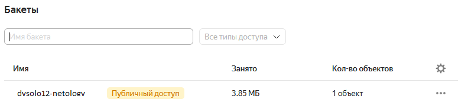
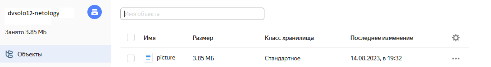
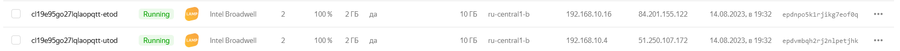
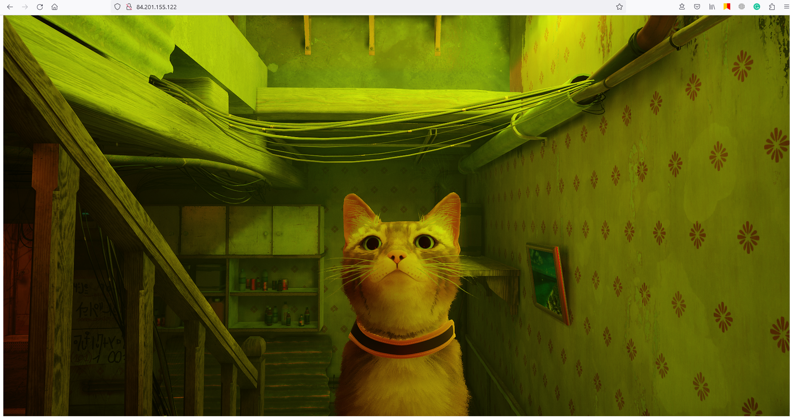

# Домашнее задание к занятию «Вычислительные мощности. Балансировщики нагрузки» Соловьев Д.В.

Terraform файлы можно найти в папке [terraform](./terraform/)  
Итог выполнения команды ```terraform apply```:  
  
  

1. Созданный bucket:  
     
   Файл в бакете:  
     
   
2. Группа ВМ:  
     
   ВМ из группы:  
     
   Загруженная в object storage [картинка](./terraform/files/picture.png) отображаемая на публичном ip адресе одной из ВМ:  
     

3. Созданный сетевой балансировщик:  
     
   Загруженная в object storage [картинка](./terraform/files/picture.png) отображаемая на публичном ip адресе балансировщика:  
     
   Картинка по прежнему доступна по адресу балансировщика не смотря на то что одна из виртуальных машин отсутствует:  
   